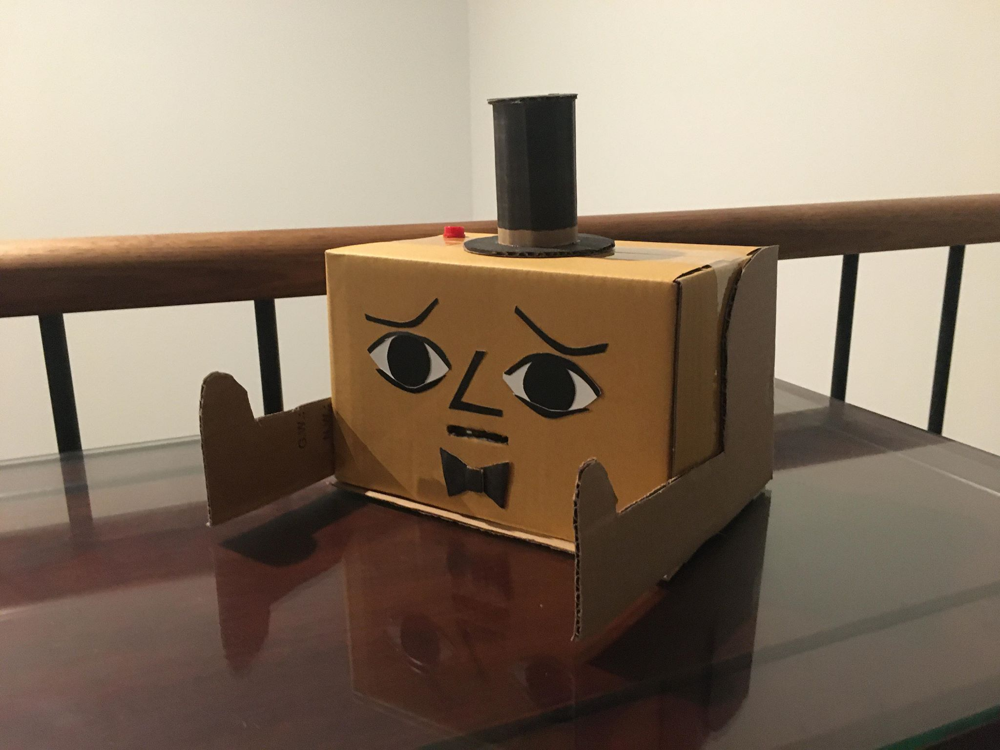
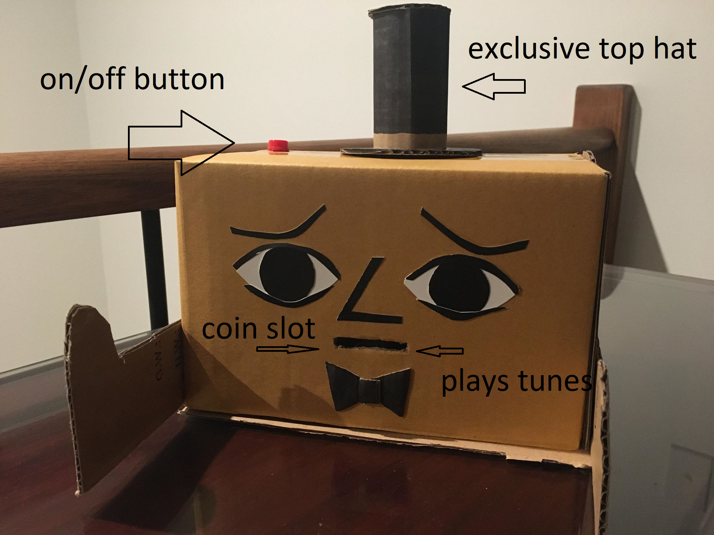

# *NagBot 3000*
## *Lai Sei Soong* ##
## 1701QCA Making Interaction 2020 Final Project ##

<!--- PROJECT DESCRIPTION: In a few sentences, describe what the project is and does, who it is for, and a typical use case. This should be suitable for a catalog, poster, or other display material about the project. --->

The Nagbot 3000 is a coin bank made to yell at those who need to save more loose change. He plays a happy melody when a coin is inserted, and mumbles an awful noise when he's hungry for more coins!

]

[]

https://www.youtube.com/watch?v=kOmgF2bH3H0&feature=youtu.be

### Journal ###

<!--- The following link will direct to your process and reflection journal, which will be held in the file `journal.md` in the folder called `journal`. This link should not be changed. --->
[Process and reflection journal](/journal/journal.md)
