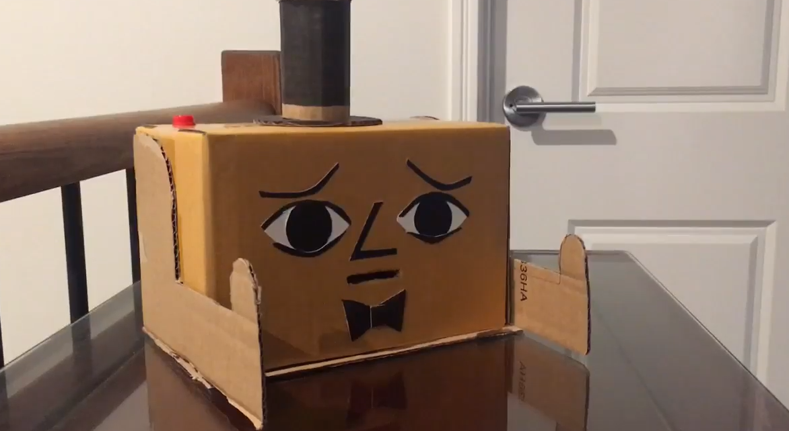

# *NagBot 3000*
## *Lai Sei Soong* ##
## 1701QCA Making Interaction 2020 Final Project ##

<!--- PROJECT DESCRIPTION: In a few sentences, describe what the project is and does, who it is for, and a typical use case. This should be suitable for a catalog, poster, or other display material about the project. --->

<!--- SECONDARY IMAGE: Provide some other image that gives a viewer a different perspective on the project such as more about how it functions, the project in use, or something else. This should not just be a different angle of the same object. It should show the project in use if the first image didn't show that, or somehow tell us a different story about the project. --->

<!--- PROJECT VIDEO: Provide a still image from your video and a link to the video below. In that code, replace `missingimage.png` with the still from your video and the URL of the video where indicated. If you link to a password protected video, you must include the password in the document you submit through Learning@Griffith. Failing to have a video that we can access might lead to significant reduction in marks, potentially as much as if the video has not been submitted at all. --->

[]https://www.youtube.com/watch?v=kOmgF2bH3H0&feature=youtu.be

### Journal ###

<!--- The following link will direct to your process and reflection journal, which will be held in the file `journal.md` in the folder called `journal`. This link should not be changed. --->
[Process and reflection journal](/journal/journal.md)
