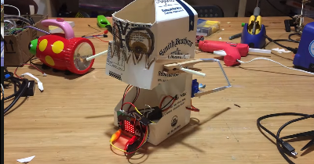
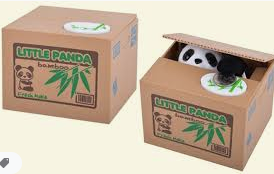
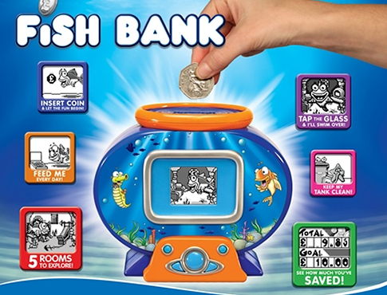
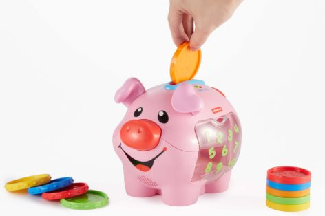
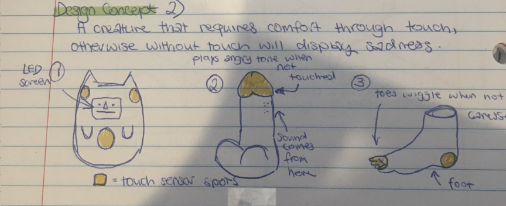
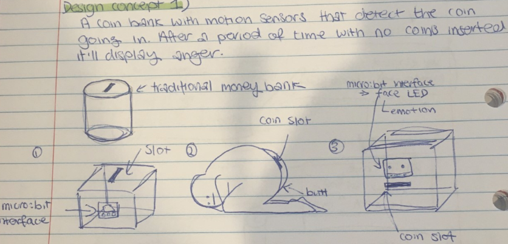
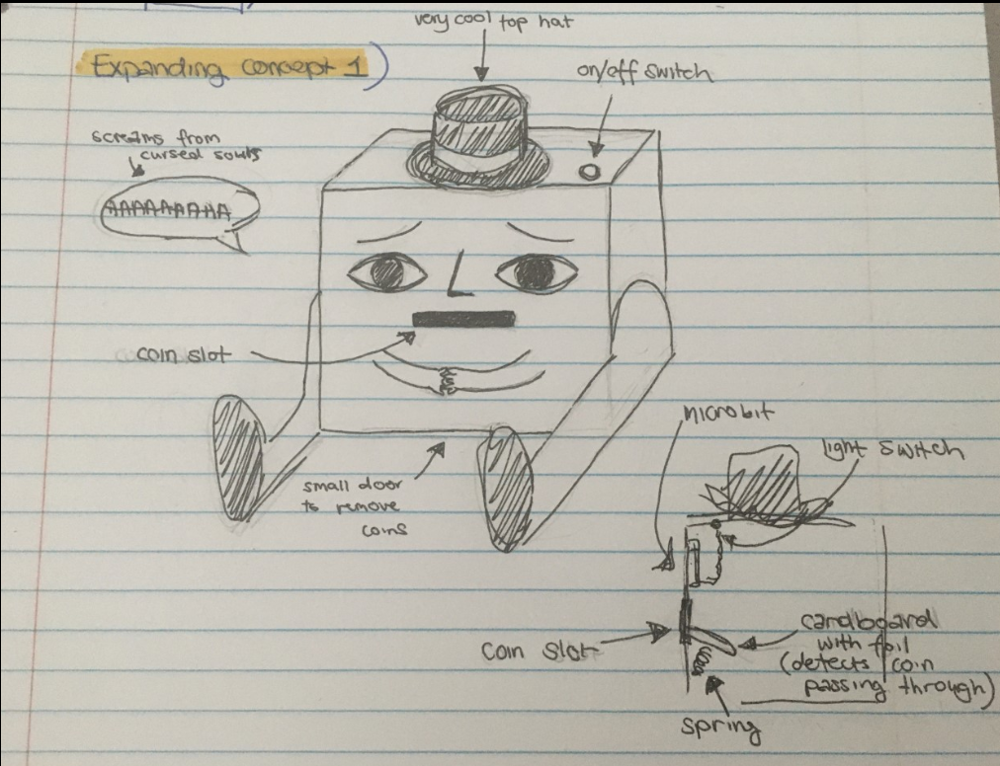
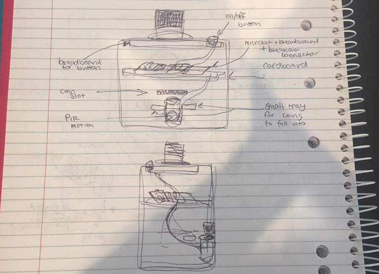
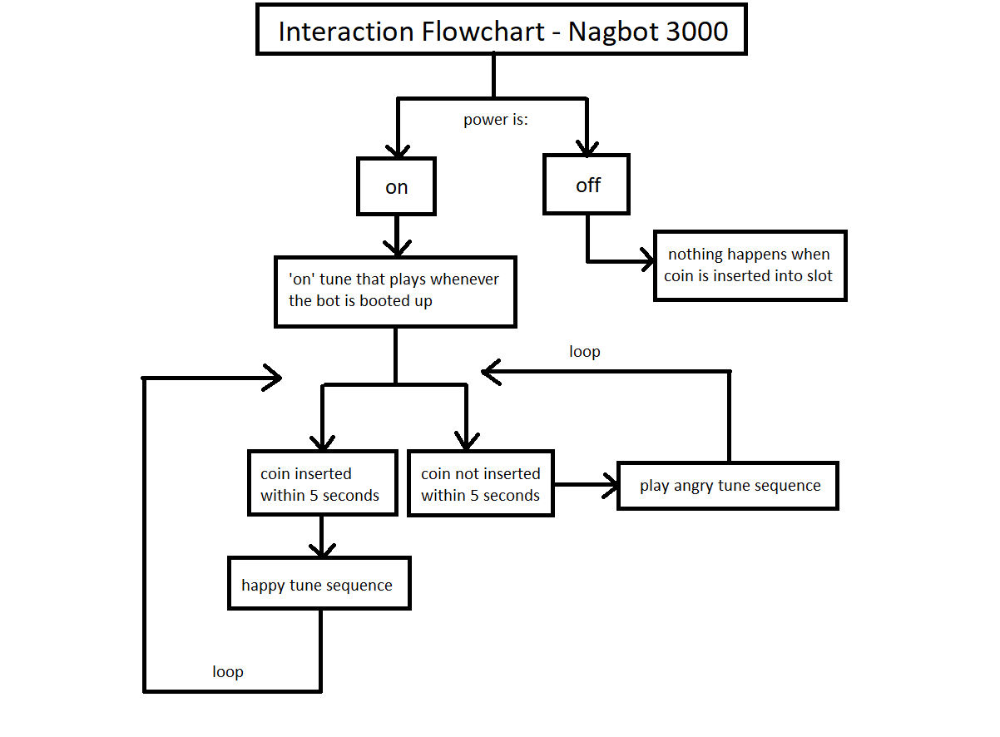

# 1701QCA Final project journal: *Lai Sei Soong*

<!--- As for other assessments, fill out the following journal sections with information relevant to your project. --->

<!--- Markdown reference: https://guides.github.com/features/mastering-markdown/ --->

## Related projects ##
<!--- Find about 6 related projects to the project you choose. A project might be related through  function, technology, materials, fabrication, concept, or code. Don't forget to place an image of the related project in the appropriate folder and insert the filename in the appropriate places below. Copy the markdown block of code below for each project you are showing. --->

### Related project 1 ###
Microbit: My robot asks me for money 

https://www.youtube.com/watch?v=Jskg6gfSGd8

I found this video while researching for Assessment 1 and it was a huge inspiration for my project. It's a robot with a simple function made possible by the micro:bit. A small detail I liked was the sound of the coin container slapping back on the table after storing the coins - it unintentially gives the robot character. 

### Related project 2 ###
Micro:bit milk jar robot

https://youtu.be/Ah4fEbJtklU

Similarly to the first related project, it's another cute robot friend. Seeing this project made me consider putting movement in my project, but it did definitely give me ideas on how to give my coin bank some personality. Maybe incorporate some movement?

### Related project 3 ###
Interactive Animal Coin Bank

https://www.youtube.com/watch?v=qJ--GDy52ns

A popular interactive toy that has a simple sensor to detect the weight of the coin, and then a character that grabs the coin. Video attached shows the mechanisms inside. This relates to my porject in terms of an event happening after the coin is inserted/placed in. 

### Related project 4 ###
Fish Bank 

https://www.youtube.com/watch?v=qVyXm434qMU

An interactive coin bank by Moose toys. I don't think this product was a huge success but it caught my eye when I was young. When a coin is inserted, a sequence of animation appears on the screen. Counts the money inserted in the bank and has various other interactive options. 

### Related project 5 ###
Fisher-Price Laugh & Learn: Learning Piggy Bank

https://www.fisher-price.com/en-us/product/laugh-learn-smart-stages-piggy-bank-cdg67

An interactive coin bank toy by Fisher Price. Has a sensor as it counts the coins and has other features such as music, silly sounds and phrases. Related to my project by it's function. 

## Other research ##
I've had a look into what I could use to implement the motion sensing for this project. I have a ultrasonic sensor lying around but I don't think that'll do the job. After some research into other projects I found a Arduino Compatible PIR Motion Detector Module (https://www.jaycar.com.au/arduino-compatible-pir-motion-detector-module/p/XC4444), but after having spoken to a Jaycar Representative they've let me know that I'd need a T-Adaptor shield. Because of self isolating as well, I've decided against this and I had the idea of implementing a similar design inspired by my timing gates project. By using cardboard and aluminium foil to detect the movement of the coin as it enters through the slot, I can get the micro:bit to play a sequence of tunes when this event occurs (happy tune). After five seconds if another coin isn't inserted again it goes to play the angry tune (see interaction flowchart).
EDIT: After deliberation I have decided to use the PIR motion sensor, as the T-Adaptor isn't actually necessary. Jaycar was wrong!

## Conceptual development ##

### Design intent ###
<!--- Include your design intent here. It should be about a 10 word phrase/sentence. --->
A device that displays emotion until a certain action is complete.
### Design ideation ###
### Design concept 2 ###

### Design concept 3 ###

### Final design concept ###
Original few designs for concept 1:

Final design 1:

EDIT: Final Concept 2.0

Exterior looks the same but the interior is redone to make more sense and function. 
### Interaction flowchart ###

## Process documentation ##
<!--- In this section, include text and images (and potentially links to video) that represent the development of your project including sources you've found (URLs and written references), choices you've made, sketches you've done, iterations completed, materials you've investigated, and code samples. Use the markdown reference for help in formatting the material.

This should have quite a lot of information! It will likely include most of the process documentation from assessment 2 which can be copied and pasted here.

Use subheadings to structure this information. See https://guides.github.com/features/mastering-markdown/ for details of how to insert subheadings.

There will likely by a dozen or so images of the project under construction. The images should help explain why you've made the choices you've made as well as what you have done. --->

## Final code ##

<!--- Include here screenshots of the final code you used in the project if it is done with block coding. If you have used javascript, micropython, C, or other code, include it as text formatted as code using a series of three backticks ` before and after the code block. See https://guides.github.com/features/mastering-markdown/ for more information about that formatting. --->

## Design process discussion ##
<!--- Discuss your process used in this project, particularly with reference to aspects of the Double Diamond design methodology or other relevant design process. --->

## Reflection ##

<!--- Describe the parts of your project you felt were most successful and the parts that could have done with improvement, whether in terms of outcome, process, or understanding.

What techniques, approaches, skills, or information did you find useful from other sources (such as the related projects you identified earlier)?

What parts of your project do you feel are novel? This is IMPORTANT to help justify a key component of the assessment rubric.

What might be an interesting extension of this project? In what other contexts might this project be used? --->
