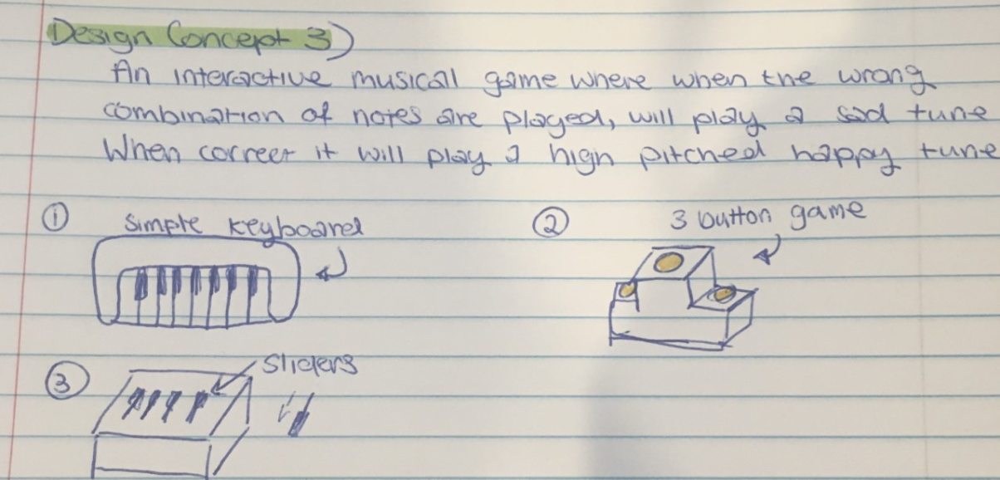

# 1701QCA Final project journal: *Lai Sei Soong*

<!--- As for other assessments, fill out the following journal sections with information relevant to your project. --->

<!--- Markdown reference: https://guides.github.com/features/mastering-markdown/ --->

## Related projects ##
<!--- Find about 6 related projects to the project you choose. A project might be related through  function, technology, materials, fabrication, concept, or code. Don't forget to place an image of the related project in the appropriate folder and insert the filename in the appropriate places below. Copy the markdown block of code below for each project you are showing. --->

### Related project 1 ###
Microbit: My robot asks me for money 

https://www.youtube.com/watch?v=Jskg6gfSGd8

I found this video while researching for Assessment 1 and it was a huge inspiration for my project. It's a robot with a simple function made possible by the micro:bit. A small detail I liked was the sound of the coin container slapping back on the table after storing the coins - it unintentially gives the robot character. 

### Related project 2 ###
Micro:bit milk jar robot

https://youtu.be/Ah4fEbJtklU

Similarly to the first related project, it's another cute robot friend. Seeing this project made me consider putting movement in my project, but it did definitely give me ideas on how to give my coin bank some personality. Maybe incorporate some movement?

### Related project 3 ###
Interactive Animal Coin Bank

https://www.youtube.com/watch?v=qJ--GDy52ns

A popular interactive toy that has a simple sensor to detect the weight of the coin, and then a character that grabs the coin. Video attached shows the mechanisms inside. This relates to my porject in terms of an event happening after the coin is inserted/placed in. 

### Related project 4 ###
Fish Bank 

https://www.youtube.com/watch?v=qVyXm434qMU

An interactive coin bank by Moose toys. I don't think this product was a huge success but it caught my eye when I was young. When a coin is inserted, a sequence of animation appears on the screen. Counts the money inserted in the bank and has various other interactive options. 

### Related project 5 ###
Fisher-Price Laugh & Learn: Learning Piggy Bank

https://www.fisher-price.com/en-us/product/laugh-learn-smart-stages-piggy-bank-cdg67

An interactive coin bank toy by Fisher Price. Has a sensor as it counts the coins and has other features such as music, silly sounds and phrases. Related to my project by it's function. 

## Other research ##
I've had a look into what I could use to implement the motion sensing for this project. I have a ultrasonic sensor lying around but I don't think that'll do the job. After some research into other projects I found a Arduino Compatible PIR Motion Detector Module (https://www.jaycar.com.au/arduino-compatible-pir-motion-detector-module/p/XC4444), but after having spoken to a Jaycar Representative they've let me know that I'd need a T-Adaptor shield. Because of self isolating as well, I've decided against this and I had the idea of implementing a similar design inspired by my timing gates project. By using cardboard and aluminium foil to detect the movement of the coin as it enters through the slot, I can get the micro:bit to play a sequence of tunes when this event occurs (happy tune). After five seconds if another coin isn't inserted again it goes to play the angry tune (see interaction flowchart).
EDIT: After deliberation I have decided to use the PIR motion sensor, as the T-Adaptor isn't actually necessary. Jaycar was wrong!

## Conceptual development ##

### Design intent ###
<!--- Include your design intent here. It should be about a 10 word phrase/sentence. --->
A device that displays emotion until a certain action is complete.

### Design ideation 2 ###

### Design ideation 3 ###

### Final design concept ###
Original few designs for design ideation 1:

Final design 1:

EDIT: Final Concept 2.0

Exterior looks the same but the interior is redone to make more sense and function. 
### Interaction flowchart ###

## Process documentation ##
<!--- In this section, include text and images (and potentially links to video) that represent the development of your project including sources you've found (URLs and written references), choices you've made, sketches you've done, iterations completed, materials you've investigated, and code samples. Use the markdown reference for help in formatting the material. --->

I began by figuring out what I wanted my coin bank to do, which were:
1. Turn on/off with an external button.
2. Detect the coin going into the bank.
3. Play sound. 

The easiest to install was the Piezo Buzzer to play sound as it's something I've done previously with other micro:bit experiments. It was quite straightforward. I put in some basic coding to make sure it worked. 

At this stage it plays the opening tune when turned on and then the angry tune after 5000 m/s. 

I then cleared this code and removed the buzzers to test the PIR motion detector using the following code: 

And yay!! No issues. Then I cleared that and worked on the external on/off button. I originally bought a pushbutton switch with a latching bottom (I think is what they're called? https://www.jaycar.com.au/spst-pushbutton-black-actuator-latching/p/SP0718) but found it much more easier to install a bigger push switch that can be connected to a breadboard. This button is attached to a separate breadboard from the piezo buzzer board. 

So I had to make some adjustments here, As I had to stick this breadboard up to the roof of the coin box with the button peaking out, I couldn't have one of my typical jumper cables with the black tip as it would block the button from being pressed. I ended up using a different wiring, and then connecting that end of the wiring to the jumper cables that I usually used. At this stage I also had my cardboard box, and cut a small hole on the top so the button can be pressed. I cut out a coin slot that's big enough to fit a 50 cent coin. 

I then worked on the PIR detector. 

And with all three elements working by themselves, it was time to code them together and have it all connected. I put all the code together, added the tunes that I desired and put pauses to hope that the coinbank could run smoother. At this stage I also added some aesthetic decoration to the coin bank, giving him a face, legs, a bowtie and a top hat. 

At this stage, the coin bank wasn't working properly. It's detection was pretty weird, and didn't work. After a lot of testing, changing the yellow pin plug in the PIR and switching to show LEDs (see final code) and it was working as well as it could with it's limits.  

After this code was finalised, I attached the breadboard with the push switch to the roof of the bank, added a storey so the micro:bit, connector, breadboard and battery pack had somewhere to stay and the PIR just under the coin slot. 

## Final code ##

## Design process discussion ##
<!--- Discuss your process used in this project, particularly with reference to aspects of the Double Diamond design methodology or other relevant design process. --->

As I outlined three relatively simple elements in my project, and was able to make each of them work individually, I didn't think I'd have trouble implementing it all together the way I did. A lot of trial and error, external help and experimentation with coding. And when one thing seemed to fix, another problem would arise. So a lot of research, developing, discovering and then evolving. And then rinse and repeat. I would find something that I think may be the solution, and then I test it out and it doesn't work. So I keep trying different things, researching and asking for help along the way until I got where I wanted. I have pretty minimal experience with coding and building tech stuff so this was all new and quite frightening. But I got there, and there's a lot more I still want to work on as well. I've picked up a bunch of parts and an Arduino kit so I can't wait to explore and play around even more with the skills that I've learnt, and discover new things. 

I was constantly learning something new every step of the way, and will continue to. 

## Reflection ##

<!--- Describe the parts of your project you felt were most successful and the parts that could have done with improvement, whether in terms of outcome, process, or understanding.

What techniques, approaches, skills, or information did you find useful from other sources (such as the related projects you identified earlier)?

What parts of your project do you feel are novel? This is IMPORTANT to help justify a key component of the assessment rubric.

What might be an interesting extension of this project? In what other contexts might this project be used? --->

For this project, there's been plenty of coin banks made before so I researched a lot of those already made products and saw what I wanted and didn't want to implement. "The Design of Everyday Things" by Don Norman is a huge resource as well for design, and I've applied his thinking to both this project and others that I've been working for in other classes. A whole lot of perservation, trial and error and help was required to get this project to do what I wanted it to do. Although the PIR detector wasn't exactly perfect and didn't perform the way I wanted it to every time, for the limitations of the PIR and the micro:bit it turned out I think the best it could. I was quite worried about the switch button but with some help that turned out to be one of the easier things to implement.  

The top hat, bowtie and Nagbot 3000's really disturbed face was just all for fun, and to give him more character rather than him being just a coin bank - with a face he seems more like a robot with emotion (disturbed emotions). This project would never, ever work as a product intended to produce and sell simply because it's just too annoying, it's mainly just for novelty purposes. 

An interesting extension for this project would be to add some motors that would allow him to have moving legs and/or arms. With that you could make him do a silly dance every time a coin was inserted!!

